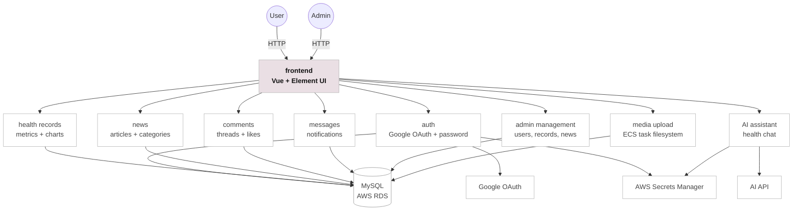

# HealthPals


HealthPals is a full-stack personal health management web application. Users can track health records, view health trends, read curated health articles, save favorites, join article discussions, receive notifications, and use an AI health assistant. Admin users can manage users, articles, categories, comments, messages, health metric models, and health records.

HealthPals is built as a Vue + Spring Boot application and deployed with a cloud-oriented stack: frontend on Vercel, backend on AWS ECS Fargate, container images in AWS ECR, data in AWS RDS MySQL, secrets in AWS Secrets Manager, and CI/CD through GitHub Actions.

Live demo: [https://health-pals.vercel.app](https://health-pals.vercel.app)

## Architecture

HealthPals is composed of a Vue frontend, a Spring Boot REST API, and domain modules for authentication, health data, articles, comments, notifications, admin management, uploads, and AI assistance. The frontend calls the backend through `/api/personal-heath/v1.0`, while the backend persists application data in MySQL and stores uploaded media on the running task filesystem for the current demo deployment.



| Service | Technology | Description |
| --- | --- | --- |
| frontend | Vue 2, Element UI, ECharts, WangEditor | Serves the user and admin web interfaces, including health dashboards, article pages, comments, notifications, profile settings, and admin tables. |
| backend-api | Spring Boot, MyBatis, JWT | Exposes the REST API under `/api/personal-heath/v1.0` and coordinates authentication, records, news, comments, messages, uploads, and admin operations. |
| auth | Google OAuth, username/password login, JWT | Handles Google sign-in, traditional account login, token issuance, and role-based access for users and admins. |
| health-records | Spring Boot, MyBatis, ECharts data | Stores health readings and returns metric data used by the dashboard charts and admin record management pages. |
| news | Spring Boot, MyBatis, WangEditor content | Provides article, category, featured article, saved article, and article detail data for the health news experience. |
| comments | Spring Boot, MyBatis | Stores article comments, replies, likes, and moderation data. |
| messages | Spring Boot, MyBatis | Provides in-app notifications such as comment replies, system messages, and metric reminders. |
| ai-assistant | Spring Boot, external AI API | Sends health assistant prompts to the configured AI provider and returns conversational responses. |
| admin-management | Spring Boot, MyBatis | Manages users, article categories, articles, comments, messages, health metric models, and health records. |
| media-upload | Spring Boot multipart upload | Accepts uploaded images and serves them from the ECS task filesystem for the current demo deployment. |
| database | AWS RDS MySQL | Persists users, roles, health records, articles, tags, favorites, comments, messages, and configuration data. |
| ci-cd | GitHub Actions, AWS ECR | Runs frontend/backend checks, validates Docker Compose, builds Docker images, and publishes production images to ECR. |

## Screenshots

| User experience | Admin experience |
| --- | --- |
| Health news, saved articles, health records, comments, notifications, and profile settings. | User management, news management, category management, health model management, records, messages, and comments. |

## Quickstart (Docker Compose)

1. Ensure you have Docker and Docker Compose installed.

2. Clone the repository and create a local environment file.

```bash
git clone https://github.com/Ruoxi-0812/HealthPals.git
cd HealthPals
cp .env.example .env
```

3. Edit `.env` and set the required values.

```text
MYSQL_ROOT_PASSWORD=your-mysql-password
GOOGLE_OAUTH_CLIENT_ID=your-google-client-id.apps.googleusercontent.com
APP_AI_API_KEY=optional-ai-api-key
```

4. Start the full stack.

```bash
docker compose up --build
```

5. Open the app.

```text
http://localhost:8080
```

6. Check service status and logs.

```bash
docker compose ps
docker compose logs -f backend
```

7. Stop the stack when finished.

```bash
docker compose down
```

## Local Development

### Backend

Create and import the database:

```bash
mysql -u root -p -e "CREATE DATABASE IF NOT EXISTS personal_health CHARACTER SET utf8mb4;"
mysql -u root -p personal_health < sql/personal_health.sql
```

Run the Spring Boot API:

```bash
export SPRING_DATASOURCE_PASSWORD='your-mysql-password'
export GOOGLE_OAUTH_CLIENT_ID='your-google-client-id.apps.googleusercontent.com'
cd backend
mvn spring-boot:run
```

The API runs at:

```text
http://localhost:21090/api/personal-heath/v1.0
```

### Frontend

Run the Vue app:

```bash
cd frontend
npm install
npm run dev
```

Open:

```text
http://localhost:21091
```

## Build

Build both applications locally:

```bash
cd frontend && npm run build
cd ../backend && mvn package -DskipTests
```

Build Docker images individually:

```bash
docker build -t healthpals-backend ./backend
docker build \
  --build-arg VUE_APP_API_BASE_URL=/api/personal-heath/v1.0 \
  --build-arg VUE_APP_GOOGLE_CLIENT_ID=your-google-oauth-client-id.apps.googleusercontent.com \
  -t healthpals-frontend ./frontend
```

## Additional Deployment Options

- **Vercel + AWS ECS Fargate**: current project deployment. Vercel serves the Vue frontend and rewrites `/api/*` requests to the backend running on ECS Fargate.
- **AWS ECR publishing**: run the `Publish Docker Images to ECR` GitHub Actions workflow to build and push backend/frontend images to ECR.
- **Local Docker Compose**: run MySQL, backend, and frontend together for local demos.
- **Manual local development**: run MySQL, Spring Boot, and Vue separately for faster iteration.

## Media Uploads

For the current project demo, uploaded media is stored on the ECS task filesystem. If an ECS task restarts, is replaced, or is redeployed, previously uploaded files may be lost.

For a production-ready version, media uploads should be migrated to persistent cloud object storage such as AWS S3 or Cloudinary.

Future enhancement:

```text
media upload migrated to cloud object storage
```

## Google Sign-In Setup

To enable `Continue with Google`, configure the same Google Web client id in both the frontend and backend:

1. Create a Google OAuth **Web application** credential in Google Cloud.
2. Add the frontend origin, such as `http://localhost:21091` or the Vercel domain, to **Authorized JavaScript origins**.
3. Set `VUE_APP_GOOGLE_CLIENT_ID` for the frontend.
4. Set `GOOGLE_OAUTH_CLIENT_ID` for the backend.

If either side is missing the client id, the Google button may be unavailable or the backend will reject Google login requests.

## Documentation

- [Deployment plan](docs/deployment.md)
- [Docker Compose](docker-compose.yml)
- [GitHub Actions CI](.github/workflows/ci.yml)
- [Publish Docker images to ECR](.github/workflows/publish-ecr.yml)
