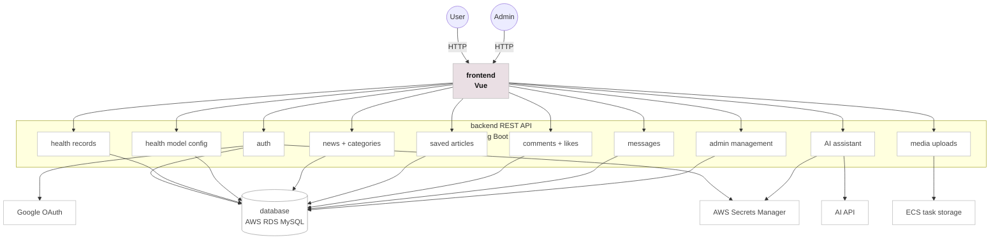

# HealthPals


HealthPals is a Vue + Spring Boot personal health app for health records, curated articles, comments, notifications, admin management, and an AI health assistant.

Live demo: [https://health-pals.vercel.app](https://health-pals.vercel.app)

## Architecture

HealthPals is organized around a Vue frontend and a Spring Boot REST API with feature modules for user health data, article reading, comments, notifications, admin management, uploads, and AI assistance.



| Service | Technology | Description |
| --- | --- | --- |
| frontend | Vue | User and admin web interface. |
| backend | Spring Boot | REST API for auth, health records, news, comments, messages, uploads, and AI assistant. |
| database | AWS RDS MySQL | Stores users, health data, articles, comments, messages, and configuration data. |
| cloud | Vercel + AWS | Vercel frontend, ECS Fargate backend, ECR images, Secrets Manager, and GitHub Actions CI/CD. |

## Quickstart

```bash
git clone https://github.com/Ruoxi-0812/HealthPals.git
cd HealthPals
cp .env.example .env
docker compose up --build
```

Open the app:

```text
http://localhost:8080
```

## Local Development

Backend:

```bash
mysql -u root -p personal_health < sql/personal_health.sql
cd backend
mvn spring-boot:run
```

Frontend:

```bash
cd frontend
npm install
npm run dev
```

## Deployment

- Frontend: Vercel
- Backend: AWS ECS Fargate
- Database: AWS RDS MySQL
- Images: AWS ECR
- Secrets: AWS Secrets Manager
- CI/CD: GitHub Actions
- Auth: Google OAuth + username/password login

Uploaded media is stored on the ECS task filesystem for the current demo deployment. For production, media uploads should be migrated to persistent object storage such as AWS S3 or Cloudinary.

## Documentation

- [Deployment plan](docs/deployment.md)
- [Docker Compose](docker-compose.yml)
- [GitHub Actions CI](.github/workflows/ci.yml)
- [Publish Docker images to ECR](.github/workflows/publish-ecr.yml)
